[](https://github.com/didifive/quickcup-app/commits/main)

[](https://luiszancanela.dev.br/)


[](https://code.visualstudio.com/)


# QuickCup APP 📋☕

APP Front-end JavaScript e React para delivery de uma cafeteria.

## 🎯 Objetivo

Este aplicativo foi criado através da oportunidade do desafio do trabalho semestral da
faculdade UNIFRAN / Cruzeiro do Sul, Projeto Integrador Transdisciplinar, do segundo
semestre de 2024. Todo o conteúdo é fictício. 

O defasio consistia em desenvolver um sistema para gerenciamento de delivery para uma cafeteria.

Para a solução, foi criado o sistema QuickCup com dois módulos:

- QuickCup API e ADMIN: O QuickCup API e Admin é essa aplicação e interface desenvolvida para o acesso da loja poder cadastrar os produtos e visualizar os pedidos realizados pelo consumidor. Nessa aplicação foram criados endpoints API REST para que o QuickCup App possa interagir com o QuickCup API.
  O QuickCup Admin foi produzido para ser responsivo, mas para uma melhor experiência é ideal acessar com notebook ou computador. Link para o repositório do API / Admin: [didifive/quickcup-api](https://github.com/didifive/quickcup-api)
- QuickCup APP: O QuickCup App foi desenvolvido com React e Bootstrap CSS para trazer experiência de responsividade para acesso por via de diversos dispositivos mobiles ou notebooks e computadores. (Projeto desse repositório)

## 🔧 Principais Tecnologias

- Node.js
- JavaScript
- React
- Axios
- Bootstrap 5
- Editor Visual Studio Code


## 📷 Prints do Projeto

### Tela de Menu
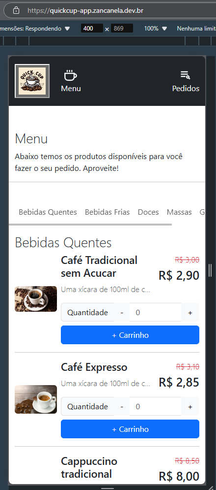

### Página Produto

#### Produto no Mobile
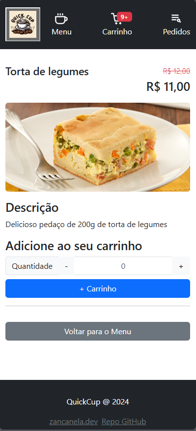

#### Produto no Desktop
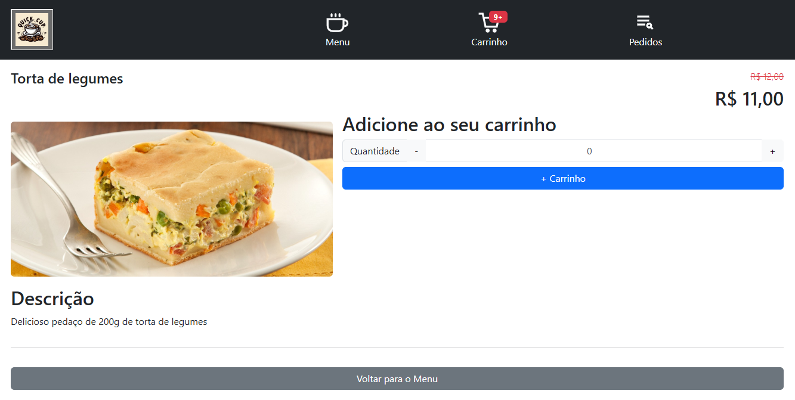

### Carrinho
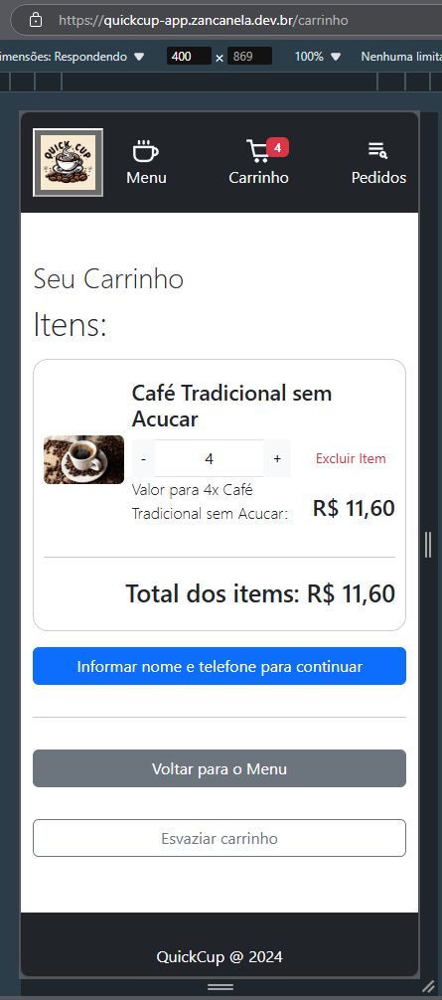

#### Carrinho com Cliente informado
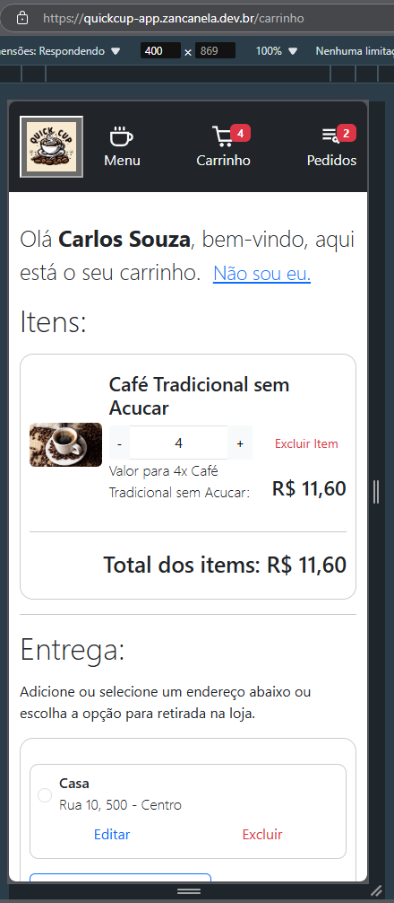
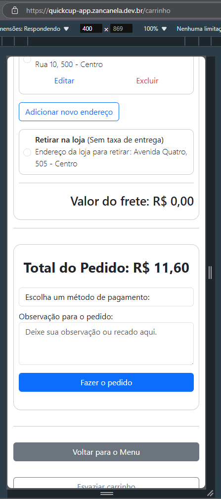

### Cliente
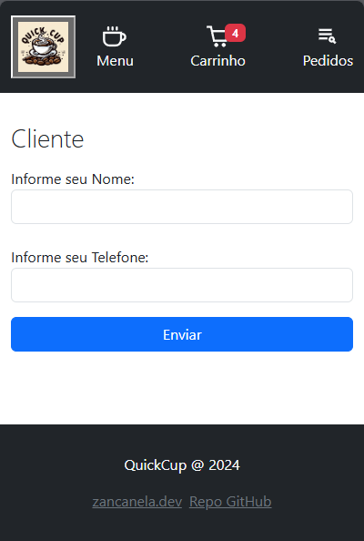

### Lista de Pedidos Feitos
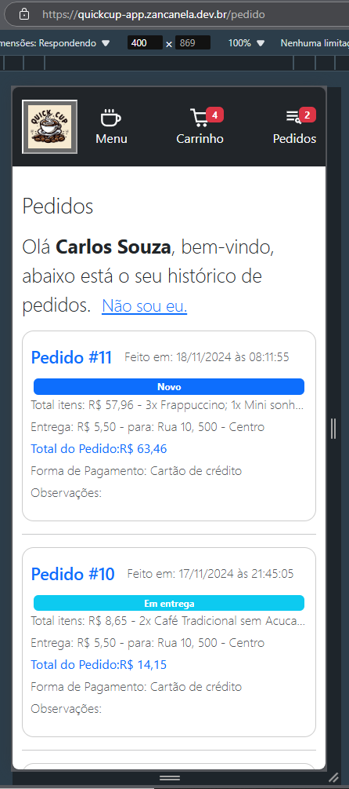  

### Pedido com status
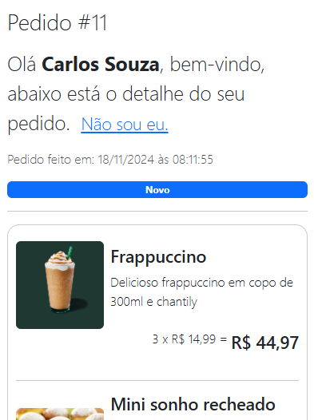
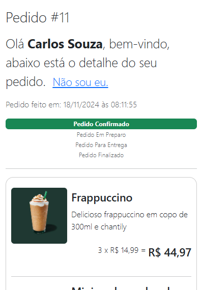
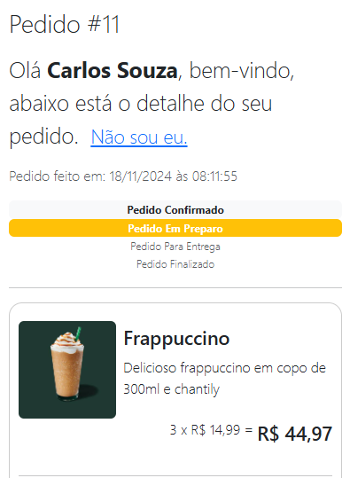
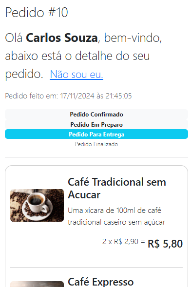
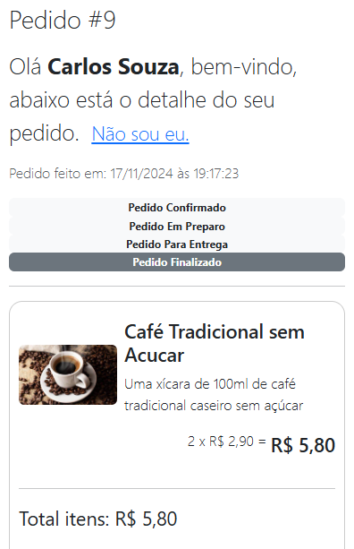
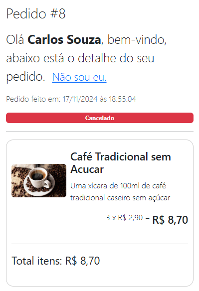


-----

## ⚙ Executando o projeto localmente
Antes de mais nada, é preciso possuir Node.js mínimo versão 20, instalado na máquina em que
irá executar. A execução do projeto pode ser feita utilizando os passos e comandos a seguir.

### 🌍 Variáveis de Ambiente

Antes de executar é preciso ter atenção e configurar as variáveis de ambiente:

- `REACT_APP_QUICKCUP_API_URL`: 
- `REACT_APP_QUICKCUP_API_KEY`:

Para facilitar eu deixei o arquivo `.env.local.sample` com as variáveis de ambiente. Basta renomear para `.env.local` para que a aplicação
carregue as informações das variáveis de ambiente.

### ⚡ Executando 

Depois de configurar as variáveis de ambiente é necessário instalar as dependencias do NPM, digite no terminal:
 
```
npm install
```

Após o NPM ter baixado e gerado a pasta node_modules, basta executar a aplicação com o comando abaixo:

```
npm start
```

## ☁️ Deploy na Nuvem
Esse projeto foi implantado no Railway que faz integração com o repositório do GitHub.
URL da aplicação: https://quickcup-app.zancanela.dev.br

-----

Feito com ❤️ e dedicação por [Luis Zancanela](https://github.com/didifive)